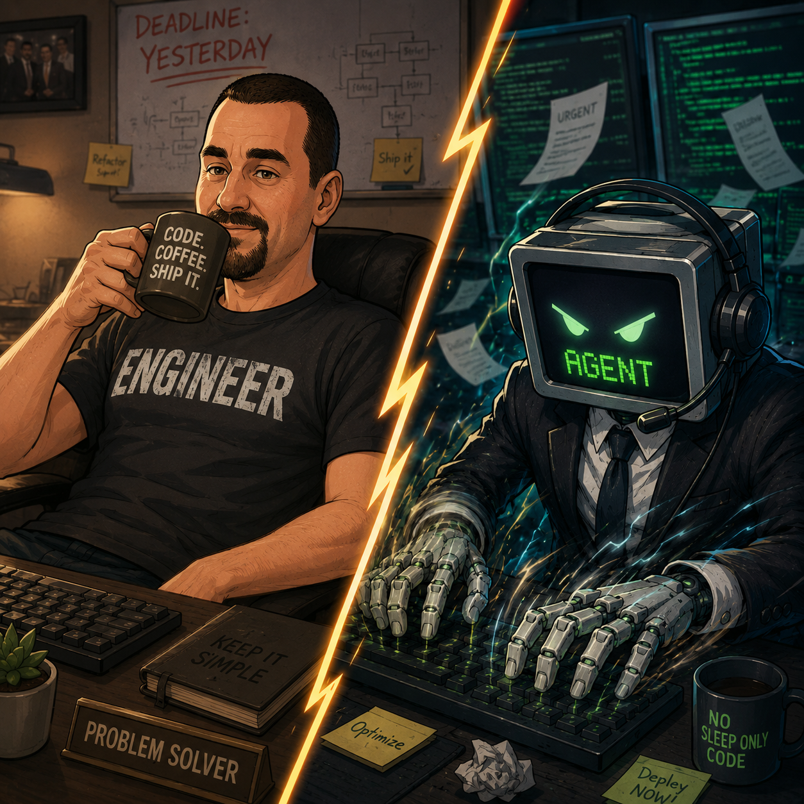

# agent-toolkit

<p align="center">
  
</p>

Opinionated, spec-driven planning and development skills for greenfield and brownfield projects. Built on the [skills.sh](https://skills.sh) ecosystem.

## Install

```bash
# All skills (recommended)
npx skills add PrintPractical/agent-toolkit --all

# Single skill
npx skills add PrintPractical/agent-toolkit --skill architect
```

Manual: copy any `skills/<name>/` folder into `~/.claude/skills/`, `~/.agents/skills/`, or `~/.config/opencode/skills/`.

---

## Quick orientation

Not sure what to do? Say **"what now"** at any time. The `what-now` skill reads your active change state and tells you the next step.

---

## Choosing your starting point

| Your situation | Start with |
|---|---|
| Existing repo with no CONTEXT.md files | `map` |
| You have a PoC you want to rebuild from scratch | `reforge` |
| Bug or small isolated fix | `triage` |
| New feature, new project, or substantial change | `architect` |

---

## Flow 1 — Brownfield onboarding (existing repo, no docs)

**Use when:** you have an existing codebase and want to start using this toolkit.

```
map
 └─ derives CONTEXT.md hierarchy from existing code
 └─ root CONTEXT.md (system architecture, glossary, tech requirements)
 └─ per-component CONTEXT.md files
 └─ stamps provenance on each file

  → now you can use architect, triage, or verify on the repo
```

**What `map` produces:**
- `CONTEXT.md` at the repo root
- `CONTEXT.md` in each major component directory
- All seams tagged `soft` by default (conservative — easy to earn `firm` later)
- `Known-soft-spots` section: explicit debt and candidates for improvement

**After `map`:** use `architect` for new features, `triage` for bugs.

---

## Flow 2 — Standard feature (the full pipeline)

**Use when:** new feature, non-trivial change, or anything that touches more than one component.

```
architect
 └─ gathers relevant CONTEXT.md files
 └─ adversarial discussion: seams, decisions, refactors, idioms
 └─ validity-check subagent hunts for gaps
 └─ produces: .changes/active/<id>/architecture.md
 └─ approves: architect gate

specify
 └─ one-question-at-a-time disambiguation interview
 └─ nails every interface change, error path, edge case
 └─ implement-as-if dry-run subagent: finds remaining gaps
 └─ produces: .changes/active/<id>/decisions.md
 └─ reconciles architecture.md
 └─ approves: specify gate

plan
 └─ decomposes into detailed task checklist
 └─ test tasks labeled by seam firmness (firm = safety net, soft = disposable)
 └─ traceability: every acceptance criterion → at least one task
 └─ produces: .changes/active/<id>/plan.md
 └─ approves: plan gate

implement
 └─ per section: write firm-seam tests (red) → implement (green) → refactor cycle
 └─ refactor cycle: poor choices, repetition, deep functions, idioms violations
 └─ firm-seam tests must stay green — failure = kickback, not a test edit
 └─ live checklist: checks off tasks as they complete
 └─ on completion: reconcile CONTEXT.md files, re-stamp provenance
 └─ approves: implement gate → docs gate → archives change
```

**Kickback protocol:** if `implement` hits a gap the spec didn't cover, it stops, logs a kickback to `manifest.yaml`, and returns to `specify`. No improvising. This is a feature — kickback frequency is the toolkit's quality metric.

---

## Flow 3 — Epic (large change spanning multiple child changes)

**Use when:** the work is too large for a single implementation cycle or naturally decomposes into independent deliverables.

```
architect (epic)
 └─ high-level design: overall seams, major decisions
 └─ identifies child changes — documented in architecture.md
 └─ does NOT create child manifests yet
 └─ approves: architect gate

specify (epic)
 └─ cross-cutting contracts ONLY: shared interfaces between children
 └─ which child owns/produces each shared interface
 └─ ordering constraints between children
 └─ dry-run: "can all children be implemented without inter-child gaps?"
 └─ produces: .changes/active/<id>/decisions.md
 └─ approves: specify gate
 └─ AUTO-RUNS epic-split: creates child change manifests
    └─ each child gets architect-seed.md seeded from the epic's context

  For each child (in dependency order, or parallel if independent):
  architect (child)
   └─ loads epic's architecture.md + decisions.md as parent context
   └─ does NOT re-litigate epic-level decisions
   └─ focuses on child-specific design
   └─ approves: architect gate

  specify (child) → plan (child) → implement (child)
  [standard pipeline per child]

  Epic is complete when all children reach done.
```

**Key rule:** epics never run plan or implement directly. Epics plan; children implement.

**Execution order — depth-first, one child at a time.** Take each child all the way to `done` (architect → specify → plan → implement) before starting the next, in dependency order. Do **not** architect/specify all children up front. This is safe because the epic's `specify` already locked the cross-cutting contracts *between* children — so each child is insulated from the others, and finishing one gives working, tested software plus lessons that inform the next. Independent children (no dependency on an incomplete sibling) may run in parallel, but each still goes through its full spine start-to-finish — never batched by stage.

If implementing a child reveals that a cross-cutting contract was wrong, that is a kickback to the **epic's** `specify` (firm-change protocol), which then propagates to any already-completed children. This should be rare — its frequency is a quality signal for the epic-level specify.

**Your epic manifest's `plan`/`implement`/`docs` gates:** if your manifest has these from before this fix was applied, they are harmless — they are never read for epics. You can ignore them or delete them from the YAML manually.

**Checking epic progress:** ask the agent **"what now"** — the `what-now` skill reads the epic manifest and reports child progress and the next step.

---

## Flow 4 — Bug / small change

**Use when:** bug, small isolated fix, single-component change with no interface changes.

```
triage
 └─ classifies: is this actually small? (escalates to architect if not)
 └─ root cause analysis
 └─ writes failing test first (red), then fix (green)
 └─ quick refactor pass
 └─ updates CONTEXT.md if needed
 └─ archives
```

**Triage escalates to `architect` when:**
- Touches more than one component
- Adds or removes a seam
- Changes an interface (even slightly)
- Root cause reveals a deeper architectural issue

---

## Flow 5 — PoC to production

**Use when:** you built a prototype and want to rebuild the production version from scratch with proper architecture.

```
reforge (run on the PoC repo)
 └─ comprehend: what does the PoC actually do (ignoring how)
 └─ extract: functional intent, domain complexity, lessons learned
 └─ identify: capabilities to preserve, anti-goals, anti-patterns to avoid
 └─ produces: reforge-seed.md

  → create a new repo
  → run architect on the new repo, seeded with reforge-seed.md
  → follow the standard pipeline from there
```

**What `reforge` discards:** all implementation code, all PoC-specific patterns, all shortcuts.
**What it keeps:** the *why*, the domain knowledge, the hard-won lessons.

---

## Flow 6 — Keeping docs current (verify)

**Use when:** code changed outside the pipeline (hotfixes, external PRs, time has passed).

```
verify
 └─ runs context-verify.mjs: finds stale CONTEXT.md files (provenance stamps)
 └─ for each stale file:
    └─ soft divergence → auto-update CONTEXT.md to match code
    └─ firm divergence → asks: intentional change (firm-change protocol)
                                or regression (flag as bug)?
 └─ re-stamps provenance on all updated files
```

**CI behavior:**
- Firm-seam test failing → hard block
- Soft prose stale → warning + `Context-Reviewed: <path>` PR trailer ack

---

## Key concepts

### CONTEXT.md

Every component carries a `CONTEXT.md`. It is the living architecture document — not full documentation, but a lean decision record:

- **Purpose** — what this component does and does NOT do
- **Architecture & Seams** — structural divisions, each tagged `firm` or `soft`
- **Interfaces/Contracts** — public API surface
- **Glossary** — domain terms as used in the code
- **Technical Requirements** — hard constraints (performance, platform, regulatory)
- **Acceptance/Behavioral Criteria** — the "definition of done" for this scope
- **Known-soft-spots** — explicit debt and improvement candidates
- **Provenance** — `validated-at: <git-sha>` (used by `verify` for staleness detection)

### Firmness

Every seam carries a firmness tag:

- **`soft`** (default) — open for challenge and improvement. The agent is expected to propose better solutions. Tests at soft seams are disposable — they churn with structure changes.
- **`firm`** (earned) — a hard contract. The user must argue the case; the agent challenges it; justification is recorded inline. Tests at firm seams are the **safety net** — never edited to make a refactor pass.

**Firm ≠ frozen.** Firm things can change through the firm-change protocol. The designation protects against *accidental* change, not *intentional* change.

### Kickback frequency

The single quality metric for the toolkit. A kickback occurs when `implement` must stop and return to `specify` due to a gap the spec didn't cover.

- `defect` kickback: the spec was wrong/incomplete. Counts against quality.
- `amendment` kickback: legitimate new information. Does not count.

If kickback frequency trends to zero, `architect` and `specify` are working. Every kickback teaches you something about the gap in your spec process.

### Change artifacts

```
.changes/
  active/<id>/
    manifest.yaml       # stage, class, gates, kickbacks — source of truth
    architecture.md     # architect output
    decisions.md        # specify output
    plan.md             # plan output (live checklist, updated by implement)
  archive/<id>.zip      # zipped on completion — agent won't read; humans can
```

`<id>` format: `YYYY-MM-DD-<slug>` (e.g. `2026-07-01-add-rate-limiter`).

### Idioms packs

Loaded by `architect`, `specify`, and `implement` based on `manifest.language`. Each pack is a power-checklist + smell-list for the language. Shipped in v1: **Rust**, **C**, **C++**.

The core principle: **use the language's own power; flag transliteration from another paradigm as a smell.** Adding a new language pack is a first-class extension point — drop `_idioms/<lang>.md`.

---

## Development

```bash
npm install
npm run build       # sync _shared/_templates/_idioms into each skill's references/
npm test            # run script unit tests
```

See `AGENTS.md` for authoring conventions when contributing skills.
